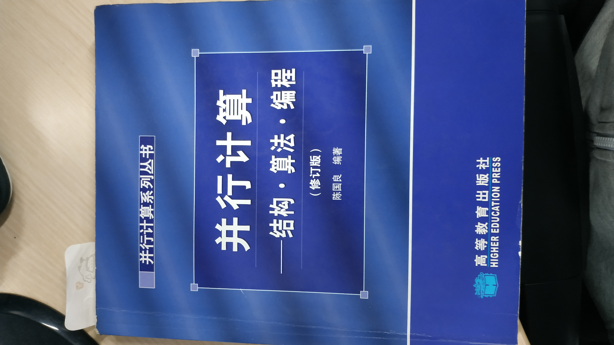

# 第1周作业（2020.11.18-2020.11.22）
### 1. GPU、CUDA相关名词解释
* 网格（grid）
* 块（block）
* 线程（thread）
* 线程束（warp）
* 流式多处理器（stream multiprocessor, SM）
* 流式处理器（stream processor, SP）
* SM上共享内存（shared memory）
* 核函数（kernel）
* __global__句柄
* __device__句柄
* __host__句柄
* PCI-E接口
* 异构计算

### 2. 并行计算相关名词解释
* 模板计算（Stencil Computation）
* 数据局部性（Data Locality）
* 数据依赖（Data Dependence）
* 线程同步（Synchronization）
* 锁（Lock）
* 列式存储（Struct of Array）
* 单指令多数据流（single instruction multiple datas stream, SIMD）

### 3. 在你的PC上安装最新版本的CUDA
https://developer.nvidia.com/zh-cn/cuda-toolkit

### 4. 实现一个CUDA版本的向量加程序
#### 要求
自己初始化两个数组a、b，对它们做加法，将结果存入数组c，打印数组c

#### 步骤提示
1. 初始化数组a、b
2. 将数组a、b的值从host端内存传输到GPU内存
3. 调用核函数计算
4. 将计算结果从GPU内存传回host端内存
5. 打印计算结果

# 第二、三周作业（2020.11.23-2020.12.6）- 基础理论
### 1. 读陈国良的《并行计算——结构、算法、编程》的第一到第七章，并解释下列名词
* 计算密集型应用
* 数据密集型应用
* 对称多处理机（SMP）
* NUMA（Non Uniform Memory Access）
* 流水线（Pipelining）
* 加速比
* 计算访存比
* 可扩展性（Scalability）
* Benchmark
* 数值计算
* 任务划分
* 并行通信
* 域分解
* 功能分解
* 负载均衡

### 2. 根据毕设任务书要求自行组织学习和动手实践
可在[超算习堂](https://www.easyhpc.net)找到HPC领域的课程和编程题，建议完成里面的OpenMP编程实训和CUDA编程实训